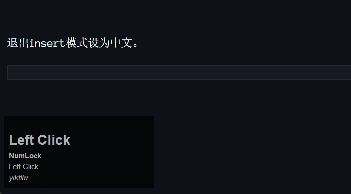

这里是由[yiktllw](https://github.com/yiktllw)魔改过的[yfzhao20/Shift-IM-for-VSCode](https://github.com/yfzhao20/Shift-IM-for-VSCode)插件，在原插件的功能下，支持在[vscode-neovim](https://github.com/vscode-neovim/vscode-neovim)切换模式时自动切换中英文。由于vscode neovim插件不提供api，所以本插件依赖于[yiktllw/vscode-neovim-api](https://github.com/yiktllw/vscode-neovim-api)

- 离开insert模式时，自动切换为英文，并记住切换前的状态。
- 进入insert模式时，切换到之前的状态
- 在insert模式时，如果在数学环境中，则切换为英文，离开数学环境切换到之前的状态。

使用效果预览:



---------------

以下是原来的readme:

---------------


# README

Automatically change IME condition. Make it easier to input $\LaTeX$ in `latex` and `markdown` file. Without AutoHotkey.


Upgrade from `Ultra IME for VSCode` Extension which is now deprecated.

---------------

## 💡 TIPS

- This extension can only work on WINDOWS, because it depends on `Win32API`.

## 📎 FAQ

- My Input Mode can not be changed.
  - Execute `shiftIm.debug` command. This command will help you set Params. If it still doesn't work, please raise an issue [HERE](https://github.com/yfzhao20/Shift-IM-for-VSCode/issues).
- Not work on Remote/SSH/WSL/Docker
  - Add following configuration to settings and reinstall the extension:
  ```json
  "remote.extensionKind": {
        "yfzhao.hscopes-booster": ["ui"],
        "yfzhao.shift-im-for-math": ["ui"],
    }
  ```